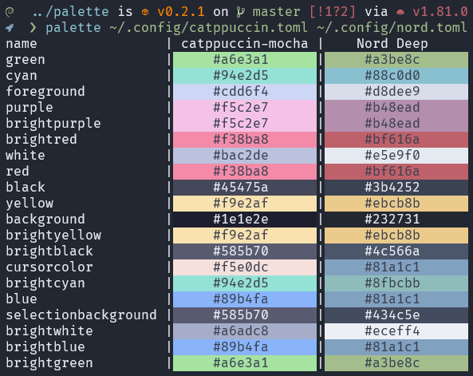

# palette

A simple CLI tool to visualize color palettes.



## Instalattion

```bash
$ cargo install palette-cli
```

## Usage

> Notice: palette requires truecolor support

```bash
$ pal --help # Help page
$ pal colors.toml other.yaml foo.json # Show a side-by-side comparison of the palettes
``` 

`palette` works by reading toml, json, yaml and nuon files that are a simple map associating a color name to a color hexcode. For instance:

### TOML
```toml
black = "#3B4252"
red = "#BF616A"
green = "#A3BE8C"
yellow = "#EBCB8B"
blue = "#81A1C1"
purple = "#B48EAD"
cyan = "#88C0D0"
white = "#E5E9F0"
name = "Nord"
```

### JSON
```json
{
    "black": "#3B4252",
    "red": "#BF616A",
    "green": "#A3BE8C",
    "yellow": "#EBCB8B",
    "blue": "#81A1C1",
    "purple": "#B48EAD",
    "cyan": "#88C0D0",
    "white": "#E5E9F0",
    "name": "Nord"
}
```

### YAML
```yaml
black: "#3B4252"
red: "#BF616A"
green: "#A3BE8C"
yellow: "#EBCB8B"
blue: "#81A1C1"
purple: "#B48EAD"
cyan: "#88C0D0"
white: "#E5E9F0"
name: "Nord"
```

### NUON
```nuon
{
    black: "#3B4252",
    red: "#BF616A",
    green: "#A3BE8C",
    yellow: "#EBCB8B",
    blue: "#81A1C1",
    purple: "#B48EAD",
    cyan: "#88C0D0",
    white: "#E5E9F0",
    name: "Nord",
}
```

A special field `name` may be provided to set the palette color. If any field besides `name` is not a valid hexcolor `palette` will display an error.

## License

[MIT](./LICENSE)

## Contributing

Any suggestion is taken in consideration. Open an issue describing your problem/suggestion. Also you might fork this repo, do your modifications and submit a Pull Request.

`palette` uses Rust 1.81

## Future Plans

- [ ] support for xml
- [ ] read a palette from piped `stdin`
- [ ] edit a palette
- [ ] usage as a library(?)